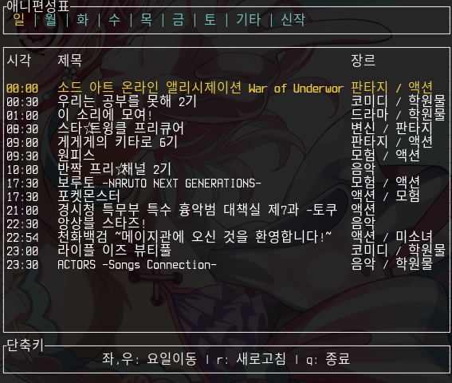

# Anitable
애니시아 애니편성표 Library & TUI 프로그램

## Library
### 사용예제
```rust
use anitable::*;

#[tokio::main]
async fn main() -> Result<(), failure::Error> {
    let client = Anitable::new();
    let data = client.list(Weekday::Sun).await?; // 일요일
    println!("{:?}", data); // 애니목록 출력

    let data = client.cap(data[0].id).await?; // 애니목록 0번째 자막
    println!("{:?}", data); // 자막목록 출력
    Ok(())
}
```

## TUI
### 미리보기


### 필요
* rust nightly 버전 이상 (`rustc 1.41.0-nightly (412f43ac5 2019-11-24)`)

### 빌드
저장소를 클론하고 다음을 실행
```bash
$ cargo build
```

### 실행
```bash
$ cargo run
```
